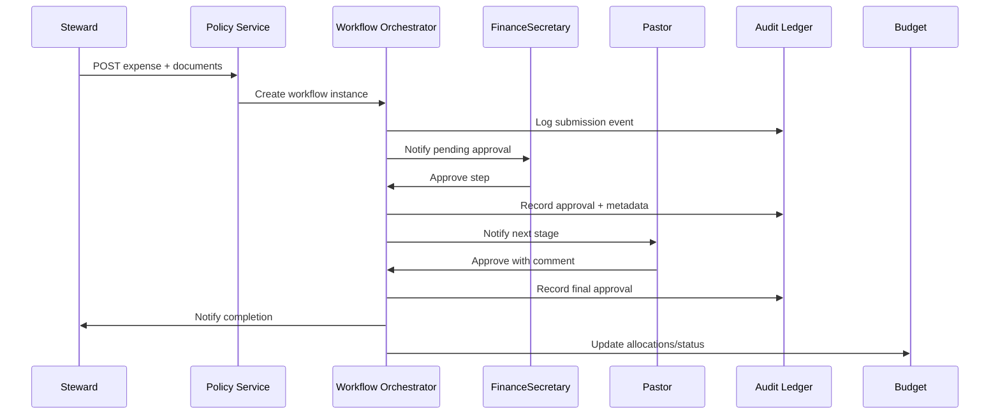

# Finance & Receipt Management Platform Specification

## 1. Product Overview
- **Mission**: Provide churches, couples, and individuals with an integrated financial management platform featuring real-time budgeting, receipt capture, reconciliation, and compliance-ready reporting.
- **Platforms**: Responsive web application plus companion mobile apps (iOS/Android) for receipt scanning and quick actions.

## 2. Target Segments & Value Propositions
- **Church Finance Teams**: Centralized budget governance, configurable approval chains, audit-ready documentation, bilingual reporting.
- **Church Stewards/Volunteers**: Guided expense submission, instant document capture, visibility into assigned envelopes.
- **Couples & Households**: Shared budgeting with privacy options, goal tracking, tithe tracking, recurring payment automation.
- **Individuals (Youth/Non-coupled)**: Personal financial planning, savings/investment tracking, optional linkage to church donations.

## 3. Core Modules & Features

### 3.1 Budget Management
- **Master Budgets**: Category hierarchies, envelope allocations, status indicators (`green/warning/red`), annual and project budgets.
- **Sub-Budgets**: Member- or steward-specific envelopes inheriting rules from parent categories.
- **Household Budgets**: Independent tenant for couples/individuals with goals, debts, savings buckets, and tithe integrations.
- **Real-Time Updates**: Transactions from manual entry, bank feeds, email/OCR ingestion reflected instantly with versioned history.

### 3.2 Approval & Governance
- **Roles**: `FinanceSecretary`, `Steward`, `Member`, `CouplePartner`, `Viewer`.
- **Rule Engine**: Admin-defined multi-level approval chains based on amount, category, project, funding source; includes escalation paths and SLAs.
- **Audit Trail**: Immutable ledger of approvals, edits, bypasses, and notifications.

## 10. Approval Engine Architecture & Workflows

### 10.1 Approval Policy Model
- **Policy Templates**: Defined per organization with YAML/JSON backing (e.g., `policies/budget.yaml`). Each template specifies trigger conditions and action pipeline.
- **Triggers**
  - Monetary thresholds (absolute amount, percent of budget, cumulative spend).
  - Category/project/fund tags, recurring vs one-time events.
  - Request metadata (submitter role, urgency flag, presence of missing documents).
- **Routing Rules**
  - Sequential or parallel approval stages (e.g., `Steward -> FinanceSecretary -> Pastor`).
  - Conditional steps (skip stage if below threshold, auto-approve recurring expense under limit).
  - Escalation settings (auto reassign if no action within SLA, notify alternates).
- **Actions**: Approve, reject with reason, request changes, add note, split cost across categories.

### 10.2 System Components
- **Policy Service**: CRUD API for policies, versioning support, validation of YAML/JSON before activation.
- **Workflow Orchestrator**: Background worker (Temporal.io/BullMQ) managing approval states, SLA timers, escalation triggers.
- **Notification Layer**: Emits events to email/SMS/push; localized templates; includes summary digests for pending approvals.
- **Audit Ledger**: Append-only table capturing state transitions, comments, and document attachments (`ApprovalEvent` entity linked to `Transaction`/`Budget`).
- **Delegation & Proxy**: Temporary delegation windows (vacation mode) with audit logging; proxies must share or exceed approver permissions.

### 10.3 User Flows
- **Submission**
  1. Steward/member submits expense with required documents and metadata.
  2. Policy engine evaluates applicable rules; generates approval path and initializes workflow instance.
- **Approval Review**
  1. Approver receives notification and views request details (budget impact, variance, documents, history).
  2. Approver acts (approve/reject/request changes). If changes requested, workflow loops back to submitter with context.
  3. Upon final approval, transaction status updates to `Approved`; budget balances adjust.
- **Escalation Scenario**
  - SLA breach triggers escalation step: reassignment, additional notification, or auto-approve depending on policy.
  - System logs escalation event and timestamps.
- **Audit & Reporting**
  - Audit trail accessible in request detail; filters for pending, overdue, escalated approvals.
  - Reports summarizing approval durations, bottlenecks, compliance breaches.

### 10.4 Edge Cases & Safeguards
- **Emergency Override**: FinanceSecretary (or higher) can override approvals with mandatory justification; flagged in audit log.
- **Document Validation**: Prevent approval completion if required receipts missing unless explicit waiver recorded.
- **Concurrency Handling**: Lock workflow state per request to prevent duplicate actions; idempotent API endpoints.
- **Offline/Mobile Support**: Approvers can act via mobile app notifications; offline queue holds action until connectivity restored.

### 10.5 Configuration Experience
- **Admin UI**: Visual builder for approval stages, drag-and-drop ordering, threshold inputs, escalation timers.
- **Simulation Mode**: Test policy against sample transactions before publish; view resulting workflow sequence.
- **Version Control**: Policies tagged with semantic version; rollback option with audit log entry.
- **Localization**: Stage names, instructions, notifications translatable; ensure bilingual configuration fields.

### 10.6 Sequence Diagram (Typical Expense Approval)



### 10.7 Detailed Workflow Narratives
- **Standard Capital Expense**
  - Trigger: Amount > CAD 5,000, category `Capital Improvements`.
  - Flow: Steward → FinanceSecretary → Pastor → Board (parallel review). SLA 48 hours per stage, auto-escalate to alternate if overdue.
  - Verification: Requires three supporting documents (quote, receipt, approval memo). Policy blocks completion until attachments verified.
- **Recurring Subscription Renewal**
  - Trigger: Flagged as recurring, amount variance within ±10% of prior cycle.
  - Flow: Auto-approval after FinanceSecretary acknowledgement (single click) if variance threshold met; otherwise reroute through full review chain.
  - Notifications: Reminder sent 7 days before renewal; summary digest to FinanceSecretary including contracts expiring.
- **Emergency Disbursement**
  - Trigger: Urgency flag set + FinanceSecretary override.
  - Flow: Immediate approval by FinanceSecretary with mandatory justification; Pastor notified post-facto for acknowledgement.
  - Safeguard: System forces follow-up audit record within 72 hours; displayed in compliance dashboard.

### 10.8 Policy Templates (Sample YAML)

```yaml
policies:
  - id: capital-expense
    name: Capital Expense Approval
    applies_to:
      categories: ["Capital Improvements", "Building Projects"]
      amount_greater_than: 5000
    stages:
      - role: Steward
        action: submit
      - role: FinanceSecretary
        sla_hours: 48
      - role: Pastor
        sla_hours: 48
      - role: BoardMember
        mode: parallel
        count_required: 2
    requirements:
      documents: ["receipt", "quote", "approval_memo"]
      allow_override: false
  - id: recurring-subscription
    name: Recurring Subscription Fast-Track
    applies_to:
      categories: ["Software", "Utilities"]
      recurring: true
      variance_percent: 10
    stages:
      - role: FinanceSecretary
        action: acknowledge
        auto_approve_if_unread: true
    escalation:
      after_hours: 24
      escalate_to: AssistantFinanceSecretary
    override:
      allow_emergency: true
      log_reason: true
```

### 10.9 Edge Case Matrix

| Scenario | Trigger Conditions | Expected Route | Safeguards | Outcome |
| --- | --- | --- | --- | --- |
| Missing documentation | Required document absent at final stage | Block at current approver | Prompt to upload, log warning, notify submitter | Remains pending until resolved |
| Approver unavailable | Approver marked on leave or SLA exceeded | Auto-delegate to proxy | Proxy must confirm receipt; audit records delegation | Workflow continues with proxy |
| Currency mismatch | Receipt currency ≠ budget currency | FinanceSecretary review + FX check | Require conversion rate entry; alert if rate stale | Approval contingent on FX validation |
| Duplicate submission | Identical amount/date/vendor within 7 days | Route to FinanceSecretary with duplicate alert | Provide link to existing record | Approver decides to merge or reject |
| Policy change mid-workflow | Policy version incremented | Continue using original policy version | Record version in workflow metadata | Consistent audit trail |

### 10.10 Implementation Backlog
- **Policy Management UI**: Build stage builder with drag-and-drop steps, threshold inputs, bilingual labels, preview panel.
- **Rule Validator Service**: Validate YAML/JSON policies against schema, enforce business rules (max stages, document requirements).
- **Workflow Simulator**: Allow admins to run sample transactions through policy to preview routing and SLAs.
- **Delegation Module**: Manage vacation schedules, proxy assignments, and escalation escalation notifications.
- **Audit Analytics**: Dashboards for approval duration, bottleneck detection, compliance breaches, override tracking.
- **Notification Templates**: Localized email/push templates for each stage outcome (pending, escalated, approved, rejected).
- **API Endpoints**: CRUD for policies, version history retrieval, policy assignment to budgets/projects.

### 3.3 Receipt & Document Capture
- **Upload Interfaces**: Drag-and-drop (PDF/JPG/PNG/HEIC, ≤10 MB, up to 20 files), progress indicators, thumbnail previews.
- **Mobile Scanner**: Camera capture with perspective correction, on-device preprocessing, immediate OCR submission.
- **Email Ingestion**: Gmail watch with AI agent classifying invoices (to pay) vs receipts (paid); unique forwarding email per organization; manual upload fallback.
- **OCR Processing**: Supabase Edge Functions or dedicated service using Azure/Google Vision; confidence scoring visualization; editable extracted fields.

## 11. Receipt Ingestion Pipeline Design

### 11.1 High-Level Flow
- **Capture Sources**: Web upload, mobile scan, Gmail ingestion, manual entry, bank import attachments.
- **Ingestion Queue**: All sources normalize metadata into `ReceiptIngestionEvent` messages placed on queue (Redis/BullMQ or Temporal activity).
- **Processing Stages**
  1. **Pre-validation**: File type/size checks, virus scanning, checksum generation.
  2. **OCR Extraction**: Invoke OCR service; parse vendor, amount, date, taxes; capture confidence scores.
  3. **Classification**: AI agent categorizes document as receipt/invoice/other; maps to budget category suggestions.
  4. **Data Enrichment**: Attempt match with existing transactions (fuzzy logic); append metadata (location, payment method) if available.
  5. **Persistence**: Store document in object storage; write structured data to `receipts` table; link to originating transaction or create placeholder.
  6. **Notification**: Inform submitter/approver of new item or pending invoice; update dashboard counts in real time.

### 11.2 Service Components
- **Upload Service**: Generates signed URLs, handles resumable uploads, triggers ingestion event upon completion.
- **OCR Worker**: Scalable serverless function or container; supports retries, configurable OCR provider per tenant.
- **Email Agent**: Gmail webhook listener storing raw MIME, running classification model, extracting attachments/bodies.
- **Matching Engine**: Microservice applying rules (amount/date proximity, vendor normalization) to suggest matches or mark unmatched.
- **Metadata Store**: `Receipts`, `Invoices`, `ReceiptDocuments`, `ReceiptProcessingLog`, `ReceiptMatchQueue` tables capturing every stage with timestamps and statuses.

### 11.3 Data Schemas (Key Fields)
- **Receipt**: `id`, `organization_id`, `source`, `status`, `vendor`, `amount`, `currency`, `tax`, `date`, `category_suggestion`, `confidence_scores`, `linked_transaction_id`, `language`, `ocr_provider`.
- **Invoice**: `due_date`, `payment_status`, `reminder_schedule`, `assigned_to`.
- **Processing Log**: `event_id`, `stage`, `status`, `timestamp`, `message`, `retry_count`.
- **Match Suggestion**: `receipt_id`, `transaction_id`, `match_score`, `criteria_breakdown`.

#### Table Definitions

| Table | Purpose | Columns |
| --- | --- | --- |
| `receipts` | Stores processed receipt metadata | `id UUID PK`, `organization_id UUID FK`, `submitted_by UUID FK`, `source ENUM('web','mobile','email','bank','manual')`, `status ENUM('processing','awaiting_match','matched','approved','archived')`, `vendor TEXT`, `amount NUMERIC(14,2)`, `currency CHAR(3)`, `tax NUMERIC(14,2)`, `total NUMERIC(14,2)`, `transaction_date DATE`, `category_suggestion UUID FK`, `confidence JSONB`, `language VARCHAR(10)`, `ocr_provider TEXT`, `document_url TEXT`, `created_at`, `updated_at` |
| `invoices` | Tracks unpaid invoices pending approval/payment | `id UUID PK`, `organization_id UUID FK`, `SOURCE ENUM`, `vendor TEXT`, `amount NUMERIC`, `currency`, `due_date DATE`, `status ENUM('pending','scheduled','paid','cancelled')`, `reminder_schedule JSONB`, `assigned_to UUID`, `linked_receipt_id UUID`, `created_at`, `updated_at` |
| `receipt_documents` | Links binary assets to receipts | `id UUID PK`, `receipt_id UUID FK`, `file_key TEXT`, `file_type TEXT`, `file_size INT`, `checksum TEXT`, `page_count INT`, `ocr_text JSONB`, `created_at` |
| `receipt_processing_log` | Records pipeline stages | `id UUID PK`, `receipt_id UUID FK`, `stage ENUM('upload','virus_scan','ocr','classification','match','persist','notify')`, `status ENUM('pending','success','failed','skipped')`, `message TEXT`, `retry_count INT`, `executed_at TIMESTAMP` |
| `receipt_match_queue` | Pending match suggestions | `id UUID PK`, `receipt_id UUID FK`, `transaction_id UUID FK`, `score NUMERIC(5,2)`, `criteria JSONB`, `expires_at TIMESTAMP` |
| `receipt_ingestion_event` | Raw ingestion events for auditing | `id UUID PK`, `source ENUM`, `payload JSONB`, `ingested_at TIMESTAMP`, `correlation_id TEXT`, `duplicate BOOLEAN` |

#### API Endpoints (Draft)

| Method | Endpoint | Description | Notes |
| --- | --- | --- | --- |
| `POST` | `/api/receipts/upload` | Initiate signed upload URL, return ingestion token | Validates file metadata, enforces quota |
| `POST` | `/api/receipts` | Finalize upload with metadata, kicks off pipeline | Accepts ingestion token, returns receipt ID |
| `GET` | `/api/receipts/{id}` | Retrieve receipt details, including OCR results and audit log | Localization via `Accept-Language` |
| `POST` | `/api/receipts/{id}/match` | Confirm match to transaction or create new transaction | Includes justification notes |
| `POST` | `/api/receipts/{id}/assign` | Assign to approver/steward with comment | Triggers notification |
| `GET` | `/api/receipts/inbox` | Paginated list filtered by status, role, time | Supports virtualization/`offset`+`limit` or cursor |
| `POST` | `/api/invoices/{id}/pay` | Mark invoice as scheduled/paid, attach payment details | Integrates with approval engine |

#### Event Contracts
- **`receipt.ingested`**: Emitted after successful persistence; payload includes receipt ID, source, suggested category.
- **`receipt.processing.failed`**: Fired when stage fails beyond retry; consumed by support dashboard.
- **`receipt.matched`**: Published when match confirmed; triggers budget updates and potential auto-approval.
- **`invoice.due_soon`**: Generated by scheduler 3/7 days before due date, ensures reminders align with approval SLAs.

### 11.4 Pipeline Reliability
- **Retry Policies**: Exponential backoff for transient OCR/email errors; dead-letter queue for manual review.
- **Idempotency**: Hash content to prevent duplicate ingestion; email agent tracks message IDs.
- **Monitoring**: Metrics on processing time per stage, failure rates, queue depth; alert thresholds for latency breaches (>5 min).
- **Data Integrity**: Ensure transactional writes—receipt record committed only after document stored successfully; use distributed transactions or compensating actions.

### 11.5 Security & Compliance
- **Encryption**: Encrypt documents at rest; use per-tenant keys where feasible.
- **Access Controls**: Signed URLs with short expiry; redaction tools for sensitive data; audit who viewed/downloaded documents.
- **PII Handling**: Minimize retention of unnecessary personal data; support redaction workflows; comply with Canadian privacy laws.
- **Localization**: OCR supports English/French; store language metadata for UI display.

### 11.6 User Experience Touchpoints
- **Progress Feedback**: Real-time upload status, OCR processing indicator, final confirmation with extracted data preview.
- **Error Handling**: Clear, localized errors; option to resubmit or send to manual review queue.
- **Inbox View**: Worklist showing new receipts/invoices, processing status badges, quick actions (categorize, match, assign).
- **Mobile UX**: Offline capture queue; uploads automatically when online; indicates OCR completion with push notification.

### 11.7 Implementation Plan
- **Milestone 1 – Infrastructure Setup**
  - Provision object storage buckets per environment; configure encryption and lifecycle policies.
  - Deploy message queue (Redis/BullMQ or Temporal namespace) with monitoring dashboards.
  - Create database migrations for `receipts`, `invoices`, `receipt_documents`, `receipt_processing_log`, `receipt_match_queue`, `receipt_ingestion_event` tables.
- **Milestone 2 – Core Ingestion Flow**
  - Build `/api/receipts/upload` and `/api/receipts` endpoints with authentication and validation.
  - Implement upload service (signed URL, resumable uploads) and ingestion event publisher.
  - Develop OCR worker MVP using chosen provider; log confidence metrics.
- **Milestone 3 – Classification & Matching**
  - Integrate AI classification service; define taxonomy for document types and categories.
  - Implement matching engine with configurable thresholds; expose manual review UI.
  - Enable `receipt.matched` events to update budgets and notify approval engine.
- **Milestone 4 – Email & Mobile Integration**
  - Configure Gmail watch and webhook handlers; ensure OAuth token storage and rotation.
  - Ship mobile offline capture queue syncing to ingestion API; add push notifications for completion.
- **Milestone 5 – Monitoring & Compliance**
  - Add metrics collection (latency per stage, failure counts) with alerting rules.
  - Implement audit dashboards and dead-letter queue processing tools.
  - Conduct security review (penetration test, privacy impact assessment) before production release.

### 11.8 Milestone 1 Execution Checklist
- **Storage Setup**
  - [ ] Create per-environment buckets (`dev`, `staging`, `prod`) with bucket policies enforcing least privilege.
  - [ ] Enable server-side encryption (KMS-managed keys) and default retention rules.
  - [ ] Configure lifecycle rules for archival/deletion after compliance period.
- **Queue Infrastructure**
  - [ ] Deploy Redis cluster or Temporal namespace with high availability.
  - [ ] Configure queue naming conventions (`receipt.ingestion`, `receipt.deadletter`).
  - [ ] Set up monitoring dashboards (Grafana/Temporal Web) and alert thresholds.
- **Database Migrations**
  - [ ] Author migration scripts for ingestion tables and run in dev environment.
  - [ ] Validate indices (e.g., `organization_id`, `status`, `ingested_at`) for performance.
  - [ ] Document rollback procedures and apply migrations to staging.
- **Secrets & Configuration**
  - [ ] Store OCR provider credentials, storage keys, and queue connection strings in secret manager.
  - [ ] Define environment variable schema and configuration files.
  - [ ] Implement configuration validation on service startup.
- **Operational Readiness**
  - [ ] Draft runbooks for storage/queue outages and recovery steps.
  - [ ] Establish logging/observability standards (structured logs, correlation IDs).
  - [ ] Schedule milestone review meeting with stakeholders to sign off on infrastructure readiness.

### 3.4 Transaction & Reconciliation
- **Bank Connections**: Optional connectors (Plaid Canada initial) with modular provider abstraction; manual CSV import supported.
- **Matching Workspace**: Split-panel drag-and-drop matching, AI suggestion scores, bulk reconciliation actions, color-coded statuses.
- **Recurring Detection**: Automated identification of recurring expenses/incomes with reminder scheduling.

### 3.5 Reporting & Analytics
- **Dashboards**: Metric cards (animated counters), trend charts, category breakdowns, net worth, donation summaries, budget vs actual.
- **Alerts**: Overspend, rapid burn rate, missing receipts, upcoming recurring payments, expiring approvals.
- **Exports**: CSV/Excel/PDF/QuickBooks-ready packages, audit bundles aligned with Quebec nonprofit standards; bilingual PDF output.

### 3.6 User Experience & Localization
- **Design System**: Tailwind-based theme, primary blue `#3B82F6`, success green `#10B981`, glassmorphism in dark mode, micro-interactions.
- **Accessibility**: ARIA coverage, keyboard navigation, screen-reader support, hint overlay for shortcuts.
- **Localization**: Full English/French support via shared catalog (`react-intl`/`react-i18next`); CAD default currency, selective USD display; localized number/date formats.
- **Notifications**: Toast feedback (`react-hot-toast`), email notifications for approvals, mobile push for urgent tasks.

## 9. Design System Specification

### 9.1 Foundations
- **Color Palette**
  - **Primary**: `#3B82F6` (actions, highlights), tinted scales at 50/100/200/500/700.
  - **Secondary**: `#10B981` (success states, positive trends), supporting shades 50–700.
  - **Neutral**: Grayscale ramp (`#0F172A` to `#F8FAFC`) for backgrounds, typography, dividers.
  - **Status Colors**: Warning `#F59E0B`, danger `#EF4444`, info `#6366F1`; align with budget health indicators.
  - Support glassmorphism overlays in dark mode using semi-transparent white/black (`rgba(255,255,255,0.08)` / `rgba(15,23,42,0.6)`).
- **Typography**
  - Heading font: `Inter` or similar geometric sans with weights 600/700.
  - Body font: `Inter`/`SF Pro` with weights 400/500.
  - Scale: Base 16 px, responsive modular scale (1.125 ratio) for H1–H6.
  - Ensure bilingual typesetting (accented characters) with fallback stack (`"Inter", "Segoe UI", "Helvetica Neue", sans-serif`).
- **Spacing & Layout**
  - 4 px spacing grid; core increments 4/8/12/16/24/32/40/48.
  - Container widths: 1280 px max desktop, 768 px tablet, fluid mobile.
  - Card padding: 24 px desktop, 16 px mobile; glass cards in dark mode with blur (12 px) and subtle border (`rgba(255,255,255,0.12)`).
- **Elevation & Shadows**
  - Use three elevation levels: base (no shadow), raised (`0 10px 30px rgba(15,23,42,0.1)`), overlay (`0 24px 60px rgba(15,23,42,0.2)`).
  - Apply softer shadows/diffuse glow in dark mode to avoid harsh contrast.

### 9.2 Components
- **Navigation**
  - Persistent side navigation for desktop with collapsible sections; bottom tab bar for mobile.
  - Breadcrumbs on detail pages (e.g., `Budgets / Youth Ministry / September 2025`).
- **Cards & Panels**
  - Metric cards with animated counters and status badges; include bilingual labels.
  - Data panels rely on modular header (title, filters, actions) and content region with pagination/virtualization.
- **Forms**
  - Use `react-hook-form` + `Zod` validators; floating labels for bilingual field hints.
  - Inline validation with iconography (`info`, `success`, `error` status colors); support split payments and multi-line currency inputs.
- **Tables & Grids**
  - Virtualized tables for receipt lists; sticky header row with filter and search controls.
  - Bulk action toolbar appears when rows selected; responsive card layout below 768 px.
- **Buttons & Interactions**
  - Primary buttons use gradient from `#3B82F6` to `#2563EB`; hover elevates with subtle shadow.
  - Secondary/ghost buttons for less prominent actions; destructive variants in `#EF4444`.
- **Feedback Components**
  - Toasts via `react-hot-toast` localized in English/French.
  - Inline banners for budget warnings, with CTA to view detailed variance report.
  - Skeleton loaders for cards/tables; shimmer animation 1.2 s loop.
- **Modals & Drawers**
  - Receipt detail modal with max width 960 px, zoom controls, tabbed sections (Details / OCR / Audit Trail).
  - Mobile uses full-height slide-up drawer with context-aware actions.

### 9.6 Token Specification

| Token Category | Name | Value | Notes |
| --- | --- | --- | --- |
| Color | `color.primary.500` | `#3B82F6` | Default primary background/border |
| Color | `color.primary.gradient` | `linear-gradient(135deg,#3B82F6,#2563EB)` | Primary button background |
| Color | `color.success.500` | `#10B981` | Positive indicators |
| Color | `color.surface.light` | `#FFFFFF` | Card/light background |
| Color | `color.surface.dark` | `rgba(15,23,42,0.6)` | Glassmorphism overlay |
| Typography | `font.family.base` | `"Inter", "Segoe UI", sans-serif` | Body and UI text |
| Typography | `font.size.base` | `1rem` (16 px) | Base font size |
| Typography | `font.lineHeight.base` | `1.5` | Paragraph line height |
| Spacing | `space.2` | `8px` | Core spacing increment |
| Spacing | `space.6` | `24px` | Card padding desktop |
| Radius | `radius.sm` | `8px` | Input/button rounding |
| Radius | `radius.lg` | `20px` | Card rounding |
| Shadow | `shadow.card` | `0 10px 30px rgba(15,23,42,0.1)` | Elevated card |
| Blur | `blur.glass` | `12px` | Dark mode glass effect |

Tokens will sync to Tailwind config via `theme.extend` mappings and to Figma using Design Tokens plugin.

### 9.7 Component Blueprints

- **Primary Button**
  - **States**: default, hover, active, disabled, loading.
  - **Specs**: Height 44 px, padding `space.4` horizontal, font weight 600, icon optional (16 px) left-aligned.
  - **Interactions**: Hover gradient shift, active scale 0.98, focus ring `0 0 0 3px rgba(59,130,246,0.35)`.
- **Metric Card**
  - **Layout**: Icon badge (32 px) top-left, label, animated value, trend indicator.
  - **Styles**: Uses `radius.lg`, `shadow.card`, gradient accent bar at top.
  - **Behavior**: Supports loading skeleton, tap/click reveals detail drawer.
- **Receipt Detail Modal**
  - **Sections**: Header with status pill, left panel preview (responsive zoom), right-side tabs (Details, OCR, Audit trail, Matching).
  - **Actions**: Primary action, secondary, overflow menu; keyboard shortcuts displayed.
  - **Accessibility**: Focus trap, escape closes, screen-reader summary of key fields.
- **Command Palette**
  - **Invocation**: `Ctrl/Cmd + K` overlay.
  - **Structure**: Search input, grouped results (Navigation, Actions, Records), highlight matching text.
  - **Localization**: Title and categories translated; fuzzy search handles accented characters.

### 9.8 Design Handoff Checklist
- **Prototype Coverage**: Desktop + mobile flows for upload, approval, dashboard, settings.
- **Annotations**: Include spacing, states, localization notes, motion specs.
- **Asset Delivery**: Export SVG icon set and illustrations; ensure alt-text guidance.
- **QA**: Conduct contrast checks, bilingual copy review, and keyboard navigation walkthrough before dev handoff.

### 9.9 Prototype Roadmap
- **Phase A (MVP Screens)**: Dashboard metrics, receipt upload modal, approval inbox, budget overview.
- **Phase B (Advanced)**: Reconciliation workspace, policy builder, reporting analytics.
- **Phase C (Mobile)**: Receipt scan flow, quick approve/reject, push notification inbox.
- Include bilingual copy variants and dark mode state in each prototype phase.

### 9.10 Phase A Prototype Tasks
- **Dashboard Metrics Screen**
  - Layout hero metrics, budget health indicator, recent activity list, alerts panel.
  - Show dark/light variants and English/French labels.
  - Annotate responsiveness (desktop/tablet breakpoints) and interaction hints (hover states, drill-down triggers).
- **Receipt Upload Modal**
  - Include drag-and-drop zone, multi-file list, progress indicators, OCR status micro-animations.
  - Provide empty, in-progress, success, and error states.
  - Detail accessibility considerations (keyboard focus order, screen-reader announcements).
- **Approval Inbox**
  - Design list view with filters (status, category, SLA), bulk actions, and preview pane.
  - Document keyboard shortcuts overlay, inline actions, and stage badges.
  - Map bilingual strings and show sample policy escalation warning.
- **Budget Overview**
  - Present category hierarchy tree, envelope allocations, variance graph, and sub-budget table.
  - Capture interaction for expanding/collapsing categories and drilling into steward assignments.
  - Include annotation on currency toggles (CAD primary, USD optional) and budget health color coding.

### 9.11 Visual Inspiration & Guidance
- **Reference Platforms**
  - **Linear**: clean typography, subtle gradients, focus on minimal yet powerful interactions.
  - **Stripe Dashboard**: data-heavy layouts with ample spacing, vibrant accent colors, polished charts.
  - **Notion AI**: modular cards, calm palettes, strong emphasis on white space and contextual actions.
- **Mood Board Themes**
  - Neutral base layers (slate, charcoal) with electric blue and emerald highlights (`primary.500`, `success.500`).
  - Glassmorphism overlays for modals/cards in dark mode; soft gradients for hero sections.
  - Micro-interaction accents (gentle scaling, shadows on hover) paired with minimalist iconography.
- **Implementation Notes**
  - Maintain 60/30/10 color balance (neutral/secondary/accent) to avoid overwhelming visuals.
  - Prefer rounded geometry (`radius.lg`) and consistent spacing rhythm (4 px grid).
  - Use `react-spring` or `framer-motion` cautiously for smooth but unobtrusive transitions.

### 9.12 UI Build Priorities (Phase A)
- **Component Library Foundations**
  - Build shared `Button`, `Card`, `Badge`, `MetricTile`, and `StatGraph` components using Tailwind tokens.
  - Implement glassmorphism variants with backdrop blur and opacity tokens for dark mode parity.
- **High-Fidelity Pages**
  - `Dashboard`: hero metrics, alerts rail, budget heat map using `react-vis` or `visx`.
  - `Receipt Inbox`: table with inline actions, status pills, AI suggestion banners.
  - `Budget Overview`: collapsible category tree, variance chips, steward assignments.
- **Micro-interactions**
  - Motion presets for hover/press (scale 0.98), card entry fades, and toast notifications.
  - Skeleton loaders with shimmering gradients for data fetch states.
- **Accessibility & Localization**
  - Minimum 4.5:1 contrast enforced via Tailwind design tokens.
  - Leverage `next-intl` for English/French copy, ensuring mirrored layout where needed.

### 9.3 Interaction Patterns
- **Micro-interactions**: Hover states, button press scale (0.98), receipt upload progress animations (stroke animations, percentage counters).
- **Transitions**: 200 ms standard easing (`cubic-bezier(0.4, 0, 0.2, 1)`); longer (300 ms) for modals/drawers.
- **Keyboard Shortcuts**: Command palette (`Ctrl/Cmd + K`) listing actions; table navigation with arrow keys; `Shift + A` to add receipt; accessible hints overlay (`?` key).
- **Dark Mode**: System preference detection; maintain minimum contrast ratio 4.5:1; glass cards with blurred background and subtle border lighting.

### 9.4 Accessibility & Localization
- **WCAG 2.1 AA** compliance baseline; test with bilingual screen readers.
- **Language Toggle**: Persistent switch in header; ensures mirrored layout for translated strings where needed.
- **Content Strategy**: Provide translation keys early; avoid text embedded in images; supply context to localization platform.
- **Iconography**: Use consistent icon set (Heroicons) with descriptive labels; ensure icons are supplemented with text.

### 9.5 Design Delivery Workflow
- **Design Tools**: Figma library for components, tokens, motion specs; maintain bilingual text styles.
- **Token Management**: Sync design tokens (colors, spacing, typography) to code via JSON/Tailwind config.
- **Review Cadence**: Weekly design-engineering sync to validate component readiness; accessibility QA checklist prior to release.
- **Documentation**: Storybook (or Ladle) for UI components with locale switcher, dark/light preview, and motion demos.

## 4. Technical Architecture

### 4.1 Frontend
- **Stack**: React or Next.js with TypeScript, Tailwind CSS, React Query/Zustand, React Hook Form + Zod.
- **Mobile**: React Native sharing data layer; prioritized features—auth, dashboard, receipt scan, approval queue.
- **State & Data**: GraphQL or REST API layer; caching with React Query; optimistic updates for document ingestion.

### 4.2 Backend & Data
- **Services**: NestJS or FastAPI microservices; optional Supabase for auth/storage/edge functions if adopting pastor’s stack wholesale.
- **Database**: PostgreSQL with role-based schemas; row-level security per tenant; Redis/BullMQ or Temporal.io for background jobs.
- **Storage**: Object storage (Supabase Storage/Azure Blob/S3) for documents with signed URL access; virus scanning pipeline.
- **AI Components**: OCR service, email classifier (Azure OpenAI/Vertex), rule engine for approvals and categorization.

### 4.3 Integrations
- **Banking**: Plaid, with roadmap for Flinks/Teller; manual CSV as fallback.
- **Email**: Gmail API with Pub/Sub notifications; future expansion to Outlook/other providers.
- **Accounting**: REST API for third-party integrations; future QuickBooks/Xero connectors.

## 5. Security & Compliance
- **Identity**: Auth0/AWS Cognito (multi-tenant, MFA, SSO); encrypted refresh tokens.
- **Data Protection**: Encryption at rest via KMS; TLS everywhere; regular key rotation.
- **Compliance**: Quebec nonprofit audit requirements, CRA, IFRS-lite export structures; 7-year retention policies; SOC2-readiness roadmap.
- **Monitoring**: Centralized logging, anomaly detection, audit dashboards; periodic penetration testing.

## 6. Performance & Reliability
- **Latency Targets**: Email-to-queue <5 minutes; OCR processing <30 seconds; dashboard interactions <200 ms perceived latency.
- **Scalability**: Horizontal scaling via container orchestration; CDN for static assets; caching for frequent queries.
- **Resilience**: Graceful degradation (offline document cache), retry/backoff strategies, health checks.

## 7. Roadmap Highlights
- **Phase 1 (MVP)**: Core budgeting, receipt upload + OCR, manual approvals, bilingual UI, basic reporting.
- **Phase 2**: Gmail ingestion, bank connectors, rule-based multi-level approvals, advanced dashboards.
- **Phase 3**: Mobile app expansion, recurring detection, API integrations, extended compliance tooling.

## 8. Next Steps
- **Design Deliverables**: Bilingual wireframes incorporating animation and accessibility expectations.
- **Technical Decisions**: Confirm Supabase vs custom backend, finalize OCR provider, draft security architecture diagrams.
- **Backlog Creation**: User stories covering ingestion workflows, rule engine, localization, reporting exports.
